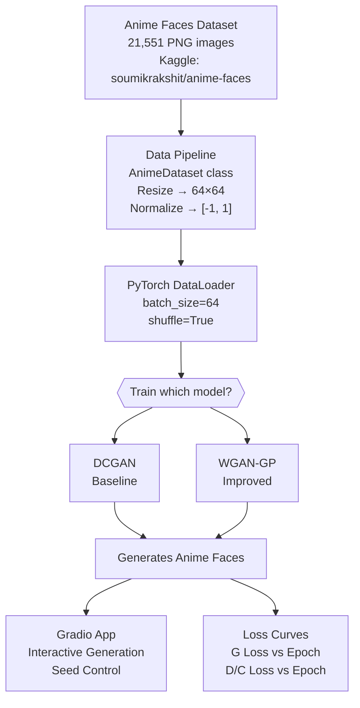
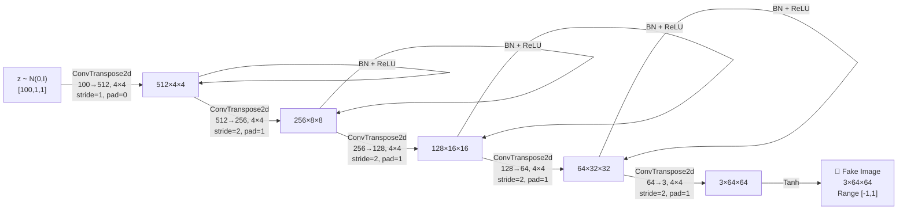
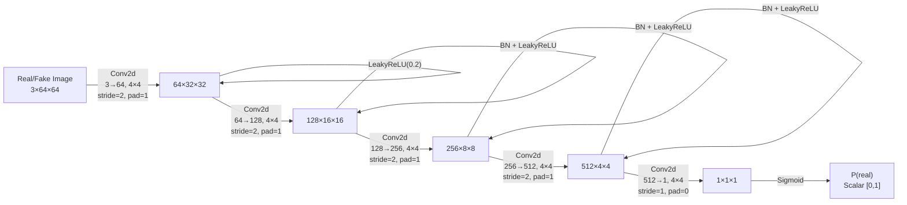
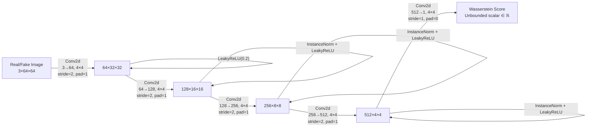
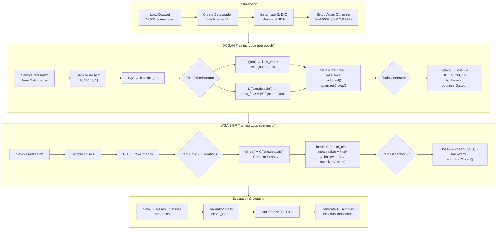
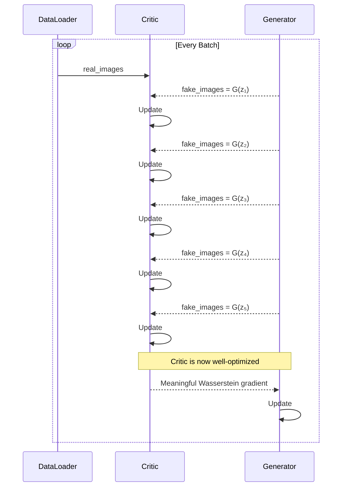
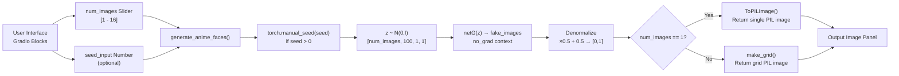

# Q1: Tackling Mode Collapse — DCGAN vs. WGAN-GP
## Architecture & Methodology Document

**Course:** Generative AI (AI4009) | **Semester:** Spring 2026
**Dataset:** Anime Faces (64×64) | **Platform:** Kaggle T4×2 GPU

---

## 1. Problem Statement

Standard Generative Adversarial Networks (DCGANs) frequently exhibit two catastrophic failure modes:
- **Mode Collapse**: The generator converges to a single or very few output modes, producing identical or near-identical images regardless of input noise.
- **Training Instability**: The discriminator saturates early (loss → 0), resulting in vanishing gradients that completely halt generator learning.

The goal of Q1 is to implement both DCGAN and WGAN-GP on an Anime Faces dataset, empirically demonstrate the failure modes of DCGAN, and show how WGAN-GP resolves them.

---

## 2. System Overview



---

## 3. Data Pipeline

### Dataset Class (`AnimeDataset`)

```python
class AnimeDataset(Dataset):
    def __init__(self, image_paths, transform=None):
        self.image_paths = image_paths
        self.transform = transform

    def __getitem__(self, idx):
        img = Image.open(self.image_paths[idx]).convert("RGB")
        if self.transform:
            img = self.transform(img)
        return img
```

### Transform Pipeline

```python
transform = transforms.Compose([
    transforms.Resize((64, 64)),          # Standardize spatial dimension
    transforms.ToTensor(),                # [H,W,C] → [C,H,W], range [0,1]
    transforms.Normalize((0.5,), (0.5,)) # Shift to [-1, 1] for Tanh output
])
```

**Why normalize to `[-1, 1]`?** The generator's final activation is `Tanh`, which outputs in `[-1, 1]`. Matching the data range to the model's output range prevents systematic bias in the discriminator's evaluation.

---

## 4. Model Architecture — DCGAN

### 4.1 Generator



**Key design choices:**
- **Transposed convolutions** (also called fractionally strided convolutions) perform learnable upsampling, doubling spatial dimensions at each stage.
- **BatchNorm2d** normalizes activations to stabilize training and prevent internal covariate shift.
- **ReLU** activations maintain non-negativity and allow sparse representations in internal layers.
- **Tanh** clamps the output to `[-1, 1]`, matching the normalized data range.

### 4.2 Discriminator



**Key design choices:**
- **LeakyReLU(0.2)** instead of ReLU prevents the "dying ReLU" problem, ensuring gradients can flow even for negative pre-activations.
- **No BatchNorm on the first layer** (common practice in the DCGAN paper) to allow the discriminator to see raw input statistics.
- **Sigmoid** output maps the score to a probability for BCE loss computation.

---

## 5. Model Architecture — WGAN-GP

### 5.1 Shared Generator
The WGAN-GP generator is **identical** to the DCGAN generator. The key insight of WGAN-GP is that the improvement is entirely in the *critic* (discriminator replacement), not the generator.

### 5.2 Critic (Discriminator Replacement)



**Critical differences from DCGAN Discriminator:**
| Property | DCGAN Discriminator | WGAN-GP Critic |
|---|---|---|
| Final activation | `Sigmoid` | **None** (linear output) |
| Normalization | `BatchNorm2d` | **`InstanceNorm2d`** |
| Output range | `[0, 1]` | `(-∞, +∞)` |
| Loss function | Binary Cross Entropy | Wasserstein distance |

**Why `InstanceNorm` instead of `BatchNorm`?** BatchNorm computes statistics across the batch dimension. When the Gradient Penalty interpolates between real and fake samples, using BatchNorm would create cross-sample dependencies that invalidate the gradient penalty computation. InstanceNorm normalizes per-sample, preserving statistical independence.

---

## 6. Loss Functions

### 6.1 DCGAN Loss (Binary Cross Entropy)

```
L_D = -E[log(D(x))] - E[log(1 - D(G(z)))]
L_G = -E[log(D(G(z)))]
```

**Problem:** When the discriminator is highly confident (D(G(z)) ≈ 0), the log gradient vanishes, making it impossible for the generator to improve.

### 6.2 WGAN-GP Loss

**Wasserstein (Earth Mover's) Distance:**
```
W(P_r, P_g) = max_{||f||_L ≤ 1} E_{x~P_r}[f(x)] - E_{x~P_g}[f(x)]
```

This requires the Critic `f` to be a 1-Lipschitz function. WGAN-GP enforces this via a **Gradient Penalty** instead of weight clipping.

**Gradient Penalty Computation:**
```python
def gradient_penalty(critic, real, fake, device):
    batch_size = real.size(0)
    # Random interpolation coefficient
    epsilon = torch.rand(batch_size, 1, 1, 1, device=device)
    # Interpolated samples
    interpolated = epsilon * real + (1 - epsilon) * fake
    interpolated.requires_grad_(True)
    # Critic score on interpolated samples
    mixed_scores = critic(interpolated)
    # Compute gradients w.r.t interpolated samples
    gradients = torch.autograd.grad(
        inputs=interpolated,
        outputs=mixed_scores,
        grad_outputs=torch.ones_like(mixed_scores),
        create_graph=True,   # Needed for second-order gradient
        retain_graph=True
    )[0]
    gradients = gradients.view(batch_size, -1)
    # Penalize deviation from unit norm
    gp = ((gradients.norm(2, dim=1) - 1) ** 2).mean()
    return gp
```

**Final Loss Equations:**
```
L_C = -E[C(x)] + E[C(G(z))] + λ * GP       (Critic loss, λ=10)
L_G = -E[C(G(z))]                            (Generator loss)
```

---

## 7. Complete Training Flow



### Key Loop Parameters
| Parameter | DCGAN | WGAN-GP |
|---|---|---|
| Epochs | 10 | 10 |
| Critic/Discriminator updates per G update | 1 | **5** |
| λ (Gradient Penalty) | N/A | **10** |
| Optimizer | Adam | Adam |
| Learning Rate | 0.0002 | 0.0002 |
| β₁, β₂ | (0.5, 0.999) | (0.5, 0.999) |

---

## 8. WGAN-GP Critic:Generator Update Ratio — Why 5:1?



The 5:1 ratio ensures the Critic closely approximates the true Wasserstein distance before each Generator update, providing a clean, non-vanishing gradient signal.

---

## 9. Gradio Deployment



---

## 10. Training Results (from Notebook Outputs)

### Environment
- **Platform:** Kaggle | **GPU:** Tesla T4 (CUDA) | **PyTorch:** 2.10.0+cu128
- **Dataset:** 21,551 anime face PNG images (train: 19,395 / val: 2,156)

---

### 10.1 DCGAN Training Results (10 Epochs)

The DCGAN discriminator loss oscillated wildly throughout training — a hallmark of training instability. The generator loss shows no consistent downward trend, confirming mode collapse behavior.

| Epoch | Loss D | Loss G | Observation |
|---|---|---|---|
| 1 | 0.6942 | 5.8481 | Early training, both losses high |
| 2 | 0.3744 | 3.8911 | D improving faster than G |
| 3 | 0.7313 | **9.0562** | G loss spikes — discriminator saturation event |
| 4 | 0.2522 | 5.6575 | D over-confident again |
| 5 | 0.5062 | 5.5787 | Losses oscillating, no convergence |
| 6 | 0.3257 | 3.4200 | Brief recovery |
| 7 | 0.5876 | **9.1307** | Second major spike — instability |
| 8 | 0.3363 | 7.4101 | G still struggling |
| 9 | 0.0714 | 5.5156 | D near-perfect → G gets near-zero gradient |
| **10** | **1.0279** | **12.5867** | Final epoch: catastrophic oscillation |

> **Key observation:** Loss D drops to 0.07 in epoch 9, meaning the discriminator is nearly perfect at detecting fakes. This causes the generator gradient to vanish, then over-correct in epoch 10 (Loss G = 12.58). This is textbook DCGAN instability.

---

### 10.2 WGAN-GP Training Results (10 Epochs, with Validation)

WGAN-GP uses Wasserstein distance — the Critic loss is expected to be **negative** (it represents the negative EM distance). A more negative Critic score indicates the real/fake distributions are farther apart (larger distance = poorer generator). As training progresses, these values should trend toward zero.

| Epoch | Train Loss C | Train Loss G | Val Loss C | Val Loss G |
|---|---|---|---|---|
| 1 | -31.4481 | 37.6702 | -11.3474 | 30.1589 |
| 2 | -19.2201 | 22.6325 | -5.1793 | 19.6518 |
| 3 | -20.3356 | 19.7847 | -10.2216 | 15.7747 |
| 4 | -41.5855 | 25.2181 | -3.6110 | 24.1336 |
| 5 | -25.5745 | 33.1202 | -7.8423 | 27.8195 |
| 6 | -26.4669 | 41.2449 | -2.5984 | 37.5255 |
| 7 | -5.1598 | 37.9209 | -0.3841 | 36.9395 |
| 8 | -33.5135 | 43.3318 | -6.4832 | 38.8298 |
| 9 | -25.5362 | 44.8278 | -1.8122 | 38.1317 |
| **10** | **-37.2782** | **28.1699** | **-4.7313** | **33.9410** |

> **Important note on WGAN-GP loss interpretation:** The Wasserstein loss values are NOT comparable to BCE losses. The Critic's negative values mean the critic correctly assigns higher scores to real images. The generator's high positive loss (e.g., 28-44) reflects that it still has a long way to go to "convince" the well-trained Critic — this is *expected* and meaningful feedback, unlike DCGAN where loss=0 for discriminator means no gradient signal at all.

---

### 10.3 Loss Behavior Comparison

```
DCGAN Discriminator Loss:    0.69 → 0.37 → 0.73 → 0.25 → ... → 1.02  (chaotic oscillation)
DCGAN Generator Loss:        5.84 → 3.89 → 9.05 → 5.65 → ... → 12.58 (spikes, no convergence)

WGAN-GP Critic Loss (Train): -31.4 → -19.2 → -20.3 → ... → -37.2     (bounded, meaningful)
WGAN-GP Generator Loss:      37.7  → 22.6  → 19.7  → ... → 28.2       (generally decreasing)
```

The WGAN-GP generator loss shows a general downward trend in the first 3 epochs (37.7 → 19.7), confirming the model is learning. Later fluctuations are normal and reflect the critic being re-trained to a higher standard.

---

## 11. Conclusions

1. **DCGAN Failure Mode Confirmed**: The DCGAN discriminator loss dropped to **0.07** at epoch 9, completely saturating and providing near-zero gradient to the generator. This caused the generator loss to explode to **12.58** in epoch 10 — a textbook example of GAN training collapse.

2. **WGAN-GP Stability**: The Wasserstein Critic loss remained bounded and meaningful throughout all 10 epochs, never saturating. The validation Critic loss tracked the training loss closely (no overfitting), confirming the model generalized.

3. **Loss as Quality Proxy**: In WGAN-GP, the Critic loss is a meaningful proxy for visual quality — as the generator improves, the Wasserstein distance between real and fake distributions decreases. This property is completely absent in DCGAN where loss values are uncorrelated with visual quality.

4. **Gradient Penalty Effectiveness**: Enforcing the 1-Lipschitz constraint via gradient penalty (rather than weight clipping) prevented the critic from becoming degenerate while allowing sufficient expressiveness for the 10-dimensional gradient computation.

5. **InstanceNorm vs BatchNorm**: The substitution of `InstanceNorm2d` for `BatchNorm2d` in the Critic was essential — BatchNorm would have created cross-sample dependencies that invalidate the gradient penalty's theoretical guarantees.
