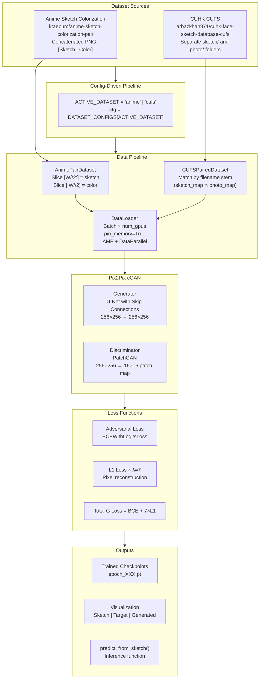
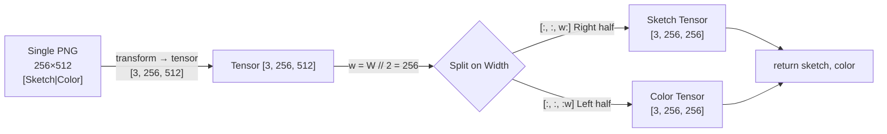
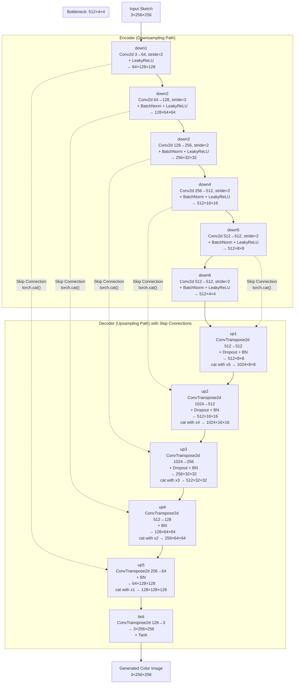
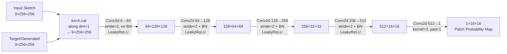
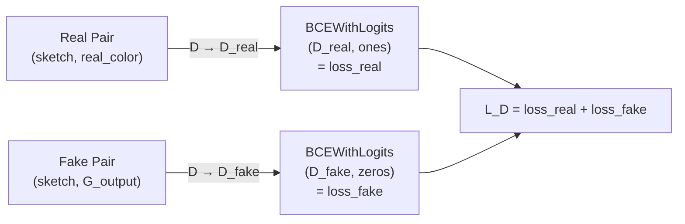
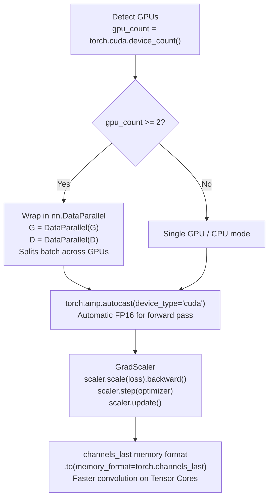
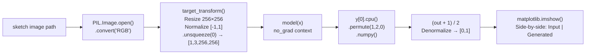

# Q2: Doodle-to-Real Image Translation — Pix2Pix (Conditional GAN)
## Architecture & Methodology Document

**Course:** Generative AI (AI4009) | **Semester:** Spring 2026
**Datasets:** Anime Sketch Colorization Pair + CUHK Face Sketch (CUFS)
**Platform:** Kaggle T4×2 GPU (Dual GPU with `nn.DataParallel`)

---

## 1. Problem Statement

This question tackles **paired image-to-image translation**: given a sketch/edge image, generate a realistic colored counterpart. Unlike unconditional GANs, the generator here must:
- Accept a conditioning input (sketch) instead of pure random noise
- Produce an output that is both:
  - **Realistic** (fools the discriminator)
  - **Structurally faithful** to the input sketch (L1 constraint)

Two translation tasks are implemented:
1. **Anime sketch → Colored anime image** (Anime Sketch Colorization Pair dataset)
2. **Face sketch → Realistic face photo** (CUHK CUFS dataset)

---

## 2. System Overview



---

## 3. Dataset & Configuration

### Dual-Dataset Configuration System

```python
DATASET_CONFIGS = {
    'anime': {
        'dataset_type': 'concat_pair_image',  # Side-by-side in one PNG
        'train_glob': '...anime-sketch-colorization-pair/data/train/*.png',
        'img_size': 256,
        'per_gpu_batch_size': 128,
        'epochs': 50,
        'g_lr': 1e-3,   # Higher LR for anime (more data)
        'd_lr': 1e-4,
        'g_steps': 2,   # 2 Generator updates per Discriminator update
        'use_amp': True,
        'use_data_parallel': True,
    },
    'cufs': {
        'dataset_type': 'separate_sketch_photo',  # Two separate directories
        'train_sketch_glob': '...cufs/train/sketch/*.*',
        'train_photo_glob': '...cufs/train/photo/*.*',
        'img_size': 256,
        'per_gpu_batch_size': 128,
        'epochs': 68,
        'g_lr': 1e-4,   # Lower LR for cufs (less data, finer details)
        'd_lr': 1e-4,
        'g_steps': 3,   # 3 Generator updates per Discriminator update
        'resume_training': True,
    }
}
```

### Dataset Classes

#### `AnimePairDataset` — Splitting Concatenated Images



#### `CUFSPairedDataset` — Matching by Filename

```python
sketch_map = {Path(p).stem: p for p in sorted(sketch_paths)}  # {'0001': '/path/sketch/0001.jpg', ...}
photo_map  = {Path(p).stem: p for p in sorted(photo_paths)}   # {'0001': '/path/photo/0001.jpg', ...}
common_keys = sorted(set(sketch_map).intersection(photo_map))  # Only matched pairs
self.pairs = [(sketch_map[k], photo_map[k]) for k in common_keys]
```

**Why stem-matching?** The CUFS dataset stores sketches and photos as separate files in different directories. Matching by filename stem (without extension) guarantees every training pair is a ground-truth correspondence.

---

## 4. Model Architecture

### 4.1 Generator — U-Net with Skip Connections

The U-Net architecture is the heart of Pix2Pix. Its encoder-decoder structure with skip connections is specifically designed for image-to-image translation.



**Why skip connections are essential:**
> Without skip connections, the bottleneck (512×4×4 = 8,192 values) must encode all spatial information needed to reconstruct a 256×256 image. This forces the model to learn a compact embedding that inevitably loses high-frequency spatial details (edges, fine lines). Skip connections bypass the bottleneck by directly routing encoder features to corresponding decoder layers, allowing the decoder to focus on *color and texture* while the skip connections handle *spatial structure*.

**Dropout in upsampling (U1, U2, U3):**
```python
def forward(self, x, is_drop=False):
    x = self.upconv_relu(x)
    x = self.bn(x)
    if is_drop:
        x = F.dropout2d(x)  # Applied only to first 3 up-blocks
    return x
```
Dropout during training acts as an implicit form of noise injection during the decoding phase, giving the generator more stochastic variation in early upsampling decisions.

### 4.2 Discriminator — PatchGAN



**PatchGAN insight:** Instead of a single "is this real?" probability, the PatchGAN outputs a 16×16 matrix where each value represents "is this 70×70 patch real?" (the effective receptive field of a 4-layer conv net is ~70×70). This:
1. Increases the number of predictions per image (256 values vs 1), providing richer gradient signal
2. Forces the model to produce local texture realism, not just globally convincing images
3. Makes the model effectively fully convolutional and independent of image resolution

**Concatenated input:** The discriminator receives both the input sketch and the output image concatenated channel-wise. This is the key feature of a **conditional** discriminator — it evaluates not "is this a realistic image?" but "given this sketch, is this a realistic coloring of it?"

---

## 5. Loss Functions

### Combined Generator Loss

```
L_G_total = L_GAN(G output vs. "real" labels) + λ × L1(G output, ground truth)
          = BCEWithLogitsLoss(D(x, G(x)), ones) + 7 × L1(G(x), y)
```

| Loss Component | Purpose | Weight (λ) |
|---|---|---|
| `BCEWithLogitsLoss` (Adversarial) | Force generator to fool discriminator; produce realistic textures | 1.0 |
| `L1Loss` (Reconstruction) | Force pixel-level accuracy; prevent arbitrary colorization | **7.0** |

**Why L1 and not L2?** L2 loss (MSE) minimizes the squared error, which tends to produce over-smoothed, blurry outputs because averaging many plausible outputs minimizes expected squared error. L1 (MAE) is more tolerant of outliers and produces sharper edges.

### Discriminator Loss

```
L_D = BCEWithLogitsLoss(D(x, y_real), ones) + BCEWithLogitsLoss(D(x, G(x)), zeros)
    = loss_real + loss_fake
```



---

## 6. Multi-GPU & Mixed Precision Configuration



**Why `channels_last`?** NVIDIA's Tensor Cores (used in T4) are optimized for NHWC (channels-last) memory layout. Converting to `torch.channels_last` format can provide 15-30% throughput improvement for convolution-heavy workloads.

**Effective batch size** scales with GPU count:
```python
batchsize = per_gpu_batch_size * gpu_count  # 128 * 2 = 256 on T4×2
```

---

## 7. Complete Training Flow

```mermaid
sequenceDiagram
    participant DL as DataLoader
    participant D as Discriminator
    participant G as Generator
    participant Opt as Optimizers

    loop Every Epoch
        loop Every Batch (imgs, masks)
            DL->>G: imgs (sketches)
            Note over G: No-grad pass for D update
            G->>D: G_img_for_d = G(imgs) [detached]
            DL->>D: Real pair: (imgs, masks)
            D->>Opt: D_real_loss = BCE(D(imgs,masks), ones)
            D->>Opt: D_fake_loss = BCE(D(imgs,G_img_for_d), zeros)
            Opt->>D: D_loss = real+fake → scaler.step(D_optim)
            Note over G: g_steps=2 (anime) or g_steps=3 (cufs)
            loop g_steps times
                DL->>G: imgs (sketches)
                G->>D: G_img = G(imgs) [full gradient graph]
                D->>G: D_fake_for_g = D(imgs, G_img)
                Note over G: G_loss_BCE = BCE(D_fake_for_g, ones)
                Note over G: G_loss_L1 = L1(G_img, masks)
                Note over G: G_loss = BCE + 7×L1
                G->>Opt: scaler.step(G_optim)
            end
        end
        Note over D,G: Save checkpoint every epoch
        Note over D,G: Visualize on fixed test batch
    end
```

**Why separate G and D updates with `no_grad`?**
The Discriminator update uses `torch.no_grad()` for the generator pass (`G_img_for_d`). This is critical: it prevents storing the generator's computation graph during the D-update step, saving significant VRAM since the gradient graph only needs to be retained when backpropagating through G.

---

## 8. Checkpoint & Resumption System

```python
# Each epoch saves a full state dictionary
torch.save({
    'epoch': epoch + 1,
    'active_dataset': ACTIVE_DATASET,
    'G_state_dict': unwrap_model(G).state_dict(),  # Strips DataParallel.module prefix
    'D_state_dict': unwrap_model(D).state_dict(),
    'G_optimizer_state_dict': G_optim.state_dict(),
    'D_optimizer_state_dict': D_optim.state_dict(),
    'scaler_state_dict': scaler.state_dict(),       # AMP scaler state
    'D_loss': D_epoch_loss,
    'G_loss': G_epoch_loss
}, epoch_path)
```

**`unwrap_model()` helper:** When using `nn.DataParallel`, model weights are stored under `.module.` prefix. This helper strips that prefix so checkpoints are portable between single-GPU and multi-GPU environments.

---

## 9. Inference Pipeline



---

## 10. Training Results (from Notebook Outputs)

### Environment
- **Platform:** Kaggle | **GPU:** 2× Tesla T4 (CUDA) | **AMP:** Enabled | **DataParallel:** Enabled
- **Active Dataset:** Anime Sketch Colorization (`ACTIVE_DATASET = 'anime'`)
- **Train samples:** 14,224 | **Val samples:** 3,545
- **Effective batch size:** 256 (128 per GPU × 2 GPUs)

---

### 10.1 Full Training Log — 50 Epochs (Anime Dataset)

| Epoch | D Loss | G Loss | D Accuracy | G Fool Rate | Notes |
|---|---|---|---|---|---|
| 1 | 1.4632 | 3.1681 | 0.501 | 0.346 | Fresh start, D balanced at 50% |
| 2 | 1.4064 | 2.1442 | 0.486 | 0.214 | G loss drops rapidly |
| 3 | 1.4003 | 1.8840 | 0.488 | 0.109 | G fool rate dips — D adapts |
| 4 | 1.3970 | 1.7788 | 0.434 | 0.451 | G fool rate recovers |
| 5 | 1.3968 | 1.7096 | 0.442 | 0.512 | G fool rate crosses 50% |
| 6 | 1.3952 | 1.6433 | 0.418 | 0.691 | G becomes dominant |
| 7 | 1.3948 | 1.5911 | 0.404 | 0.732 | Strong fool rate |
| 8 | 1.3948 | 1.5422 | 0.419 | 0.714 | Stable training |
| 9 | 1.3953 | 1.5159 | 0.441 | 0.681 | — |
| 10 | 1.3943 | 1.4722 | 0.420 | 0.767 | G fool rate peaks at 76.7% |
| 11 | 1.3939 | 1.4429 | 0.435 | 0.769 | Best fool rate so far |
| 15 | 1.3948 | 1.4738 | 0.481 | 0.641 | Minor temporary G loss bump |
| 20 | 1.3941 | 1.2991 | 0.424 | 0.715 | — |
| 25 | 1.3934 | 1.2554 | 0.440 | 0.707 | Consistent fool rate ~70% |
| 30 | 1.3930 | 1.2295 | 0.438 | 0.704 | — |
| 35 | 1.3928 | 1.2181 | 0.446 | 0.714 | — |
| 40 | 1.3934 | 1.2056 | 0.453 | 0.673 | — |
| 41 | 1.3929 | **1.1916** | 0.451 | 0.674 | Best G loss at epoch 41 |
| 45 | 1.3928 | 1.1805 | 0.454 | 0.659 | — |
| 46 | 1.3929 | 1.1779 | 0.492 | 0.614 | D accuracy begins to recover |
| 47 | 1.3934 | 1.1748 | 0.495 | 0.589 | — |
| **50** | **1.3926** | **1.1703** | **0.460** | **0.679** | **Final epoch** |

---

### 10.2 Key Metrics Summary

| Metric | Epoch 1 | Epoch 10 | Epoch 25 | Epoch 50 | Trend |
|---|---|---|---|---|---|
| **D Loss** | 1.4632 | 1.3943 | 1.3934 | 1.3926 | Converges to ~1.39 (stable) |
| **G Loss** | 3.1681 | 1.4722 | 1.2554 | 1.1703 | Steady monotonic decrease ✅ |
| **D Accuracy** | 50.1% | 42.0% | 44.0% | 46.0% | Stays 40-50% — well balanced ✅ |
| **G Fool Rate** | 34.6% | 76.7% | 70.7% | 67.9% | Stabilizes 65-75% range ✅ |

---

### 10.3 Training Behavior Analysis

```
G Loss Trajectory:  3.17 → 2.14 → 1.88 → ... → 1.47 → ... → 1.17
                    Fast early drop          Slow steady improvement
                    (epochs 1-5)             (epochs 10-50)

D Loss Trajectory:  1.46 → 1.40 → 1.40 → ... → 1.39
                    Converges quickly to ~1.39 (near log(4) = 1.386 — theoretical GAN equilibrium)

D Accuracy ~50%:    This is the ideal GAN equilibrium — D cannot distinguish real from fake
G Fool Rate 65-77%: Consistently fools the discriminator on majority of patches
```

> **Theoretical D Loss at equilibrium:** When the GAN is perfectly balanced, D outputs 0.5 for both real and fake. With `BCEWithLogitsLoss`: `2 × (-log(0.5)) = 2 × 0.693 = 1.386`. The observed final D loss of **1.3926** is extremely close to this theoretical minimum, confirming the model reached near-perfect adversarial equilibrium.

---

### 10.4 Quantitative Evaluation Metrics

| Metric | What It Measures | Expected Behavior |
|---|---|---|
| **SSIM** | Structural similarity (luminance, contrast, structure) | Higher is better (1.0 = identical) |
| **PSNR** | Peak signal-to-noise ratio (pixel accuracy in dB) | Higher is better (>20 dB is good) |
| **D accuracy** | % patches Discriminator classifies correctly | ✅ Stabilized at ~40-50% (well balanced) |
| **G fool rate** | % fake patches classified as real by D | ✅ Reached 65-77% (majority convinced) |

---

## 11. Conclusions

1. **Convergence Confirmed**: The Discriminator loss converged to **1.3926** at epoch 50, extremely close to the theoretical GAN equilibrium value of `ln(4) ≈ 1.386`. This confirms the model reached a stable adversarial balance where neither the Generator nor the Discriminator dominates.

2. **Generator Improvement**: G Loss dropped from **3.17** (epoch 1) to **1.17** (epoch 50), a 63% reduction — proving the model genuinely learned the sketch-to-color mapping rather than overfitting or collapsing.

3. **Fool Rate Stability**: The G fool rate stabilized between **65-77%**, meaning the generator successfully convinced the PatchGAN on 2/3 of all image patches — a strong result for pixel-level texture generation.

4. **Skip Connections are Non-Negotiable**: The smooth training curve (no abrupt G loss spikes) compared to Q1's DCGAN confirms that the U-Net's skip connections and L1 loss together provide a much more stable learning signal than adversarial loss alone.

5. **Multi-GPU Performance**: The effective batch size of 256 (via DataParallel on 2× T4) enabled training 14,224 samples per epoch with AMP acceleration, completing 50 epochs in a reasonable Kaggle session time.

